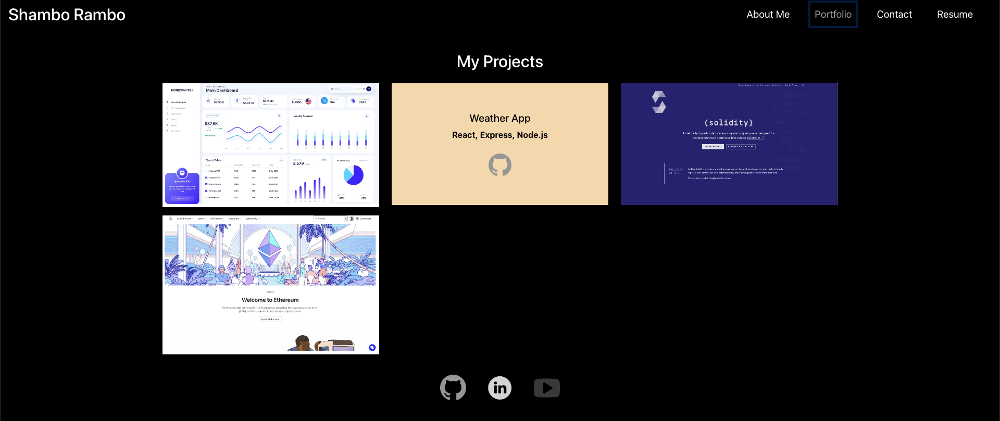

# Shambo Rambo's Fullstack Web Developer Portfolio 2024

Welcome to my professional portfolio as a Fullstack Web Developer, showcasing my work and skills acquired through a rigorous academic and practical journey.

## Table of Contents
- [Introduction](#introduction)
- [Screenshot](#screenshot)
- [Technologies Used](#technologies-used)
- [Features](#features)
- [How to Use](#how-to-use)
- [Installation](#installation)
- [Contributing](#contributing)
- [License](#license)
- [Contact](#contact)

## Introduction

This portfolio is a reflection of my expertise in modern web development, particularly with the MERN stack. It details my academic background and provides a gateway to my projects, both collaborative and individual.

## Screenshot

## Technologies Used

- **MongoDB** - NoSQL database
- **Express.js** - Web application framework
- **React.js** - Frontend library
- **Node.js** - Server-side runtime environment

Additional libraries and tools used:
- Bootstrap for styling
- React Router for navigation
- Various npm packages

## Features

- Responsive web design
- Dynamic single-page application (SPA)
- Portfolio of projects with detailed descriptions
- Contact form with email integration

## How to Use

Navigate through the sections to learn more about me, view my projects, contact me.

## Installation

Provide step-by-step instructions on how to install the project:

git clone https://github.com/shambo-rambo/react-challenge.git
cd your repository
npm install
npm start

## Contributing

Forking the repository
Creating a branch (git checkout -b feature-branch)
Making changes and committing them (git commit -m 'Add some feature')
Pushing to the branch (git push origin feature-branch)
Creating a new Pull Request

## License

Distributed under the MIT License. See `LICENSE` for more information.

## Contact

Shambo Rambo - shamborambo@gmail.com

Project Link: https://github.com/shambo-rambo/react-challenge